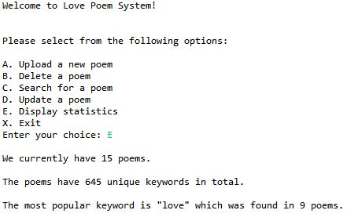
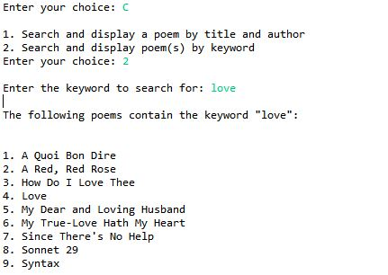

# Search Engine

## Course: Data Abstract & Structure
#### Data and Topic Requirements :
You must select one of the below four topics as the focus of your project. 

Songs 
Poetry 
Blog posts  
Recipes  

Within your topic, you will need to select a focus or genre. Some examples of genres are as follows: 

Songs: Rap, or 1940s hits, or Pink Floyd songs, etc  
Poetry: Haiku, or Love Poems, or Elizabethan poetry, etc.  
Blog posts: Travel blogs, or tech blogs, or cooking blogs, etc.  
Recipes: French cooking, or vegan cooking, or desserts, etc.  

The data collection is of your own choice, with the requirement that each record in the system must contain a unique key (must be a string), and at least three non-key fields, one of which must be the full text of the entry for that particular record. For instance, you might select a collection of poems with the following attributes: 

- Title + Author– unique key 
- Year 
- Country of origin 
- Full Text of poem

Users of your system must be able to upload additional records contained in additional files. 

#### Menu Requirements:
You must create an interactive data processing system, with a menu of options provided to the user. Your project must display the following options for the user:

- Upload a new record 
- Delete a record 
- Search for a record (has a sub-menu) 
 - Find and display one record using the primary key 
 - Find and display records using keywords (your search engine) 
- Modify or update a record 
- Statistics (When this option is selected, your program must display at least 3 different statistics of your choice about the data) 
- Quit 
  - Write all records to a file of user choice and exit the program  

At the end of the program, the data is to be automatically written to a text file whose name is typed in by the user.
#### Required Data Structures:
The system’s data structures must contain Hash Table, BST, ArrayList, of BSTs.
#### Search Engine Requirements:
The heart of this project is to create a search engine. The purpose of your search engine is to allow users to search via keyword for entries in your system. For example, if the user types in the word "love" to the search engine, the title of each record where the word "love" appears in the text should be alphabetically sorted and displayed ato the user. The user should then be able to select the entry of his or her choice to view additional information. 
 
<b>The search engine will build what is known as an inverted index - a well-known technique from a subfield of computer science known as information retrieval </b>

## Snip of my output :arrow_down:    
\
 

